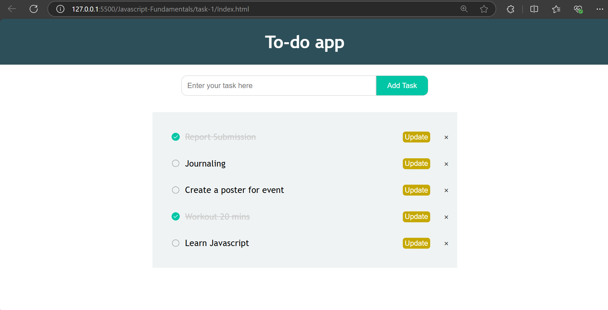
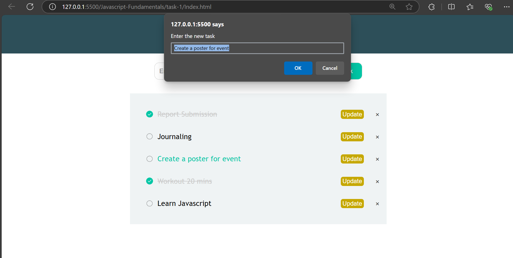
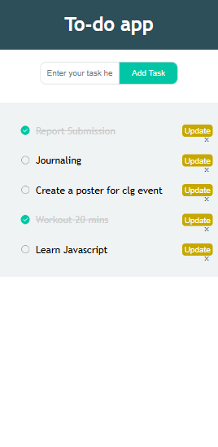

# Interactive To-Do List Application
## Created a To-do app, in that users can 
- Create new task
- Edit the created task
- Delete the task
- Stores the tasks in browser with the help of localstorage

``` bash
function getTasks() {
  const tasks = JSON.parse(localStorage.getItem("tasks"));
  if (tasks) {
    tasks.forEach((task) => {
      createTaskElement(task.text, task.completed);
    });
  }
}
```
- Helps to retrieve the task that are stored in localstorage and create that element which are already present

```bash
function createTaskElement(taskText, isCompleted = false) {
  const task_li = document.createElement("li");
  if (isCompleted) task_li.classList.add("checked");

  task_li.innerHTML = `
    ${taskText}
    <span>&times;</span>
    <button>Update</button>
  `;

  task_list.appendChild(task_li);
}
```
- Helps to create a new element either new task or existing from localstorage


``` bash
function createTask() {
  const taskText = input.value.trim();

  if (taskText === "") {
    alert("Please enter a task");
    return;
  }

  createTaskElement(taskText);
  saveTasks();
  input.value = "";
}
```
- Helps to triggers the creation of new task and by default the creation of new task have `isCompleted - false`


``` bash
function saveTasks() {
  const tasks = [];

  const taskItems = task_list.querySelectorAll("li");
  taskItems.forEach((taskItem) => {
    const taskText = taskItem.firstChild.textContent.trim();
    const isCompleted = taskItem.classList.contains("checked");
    tasks.push({ text: taskText, completed: isCompleted });
  });

  localStorage.setItem("tasks", JSON.stringify(tasks));
}
```
- Helps to save the tasks in the localstorage for persistence 
- this stores in the format of array of objects with task name and completed flag
- This list have 3 child (text content, delete_task (span), update(button)) - stores only text content in the localstorage


``` bash

task_list.addEventListener("click", function (e) {
  if (e.target.tagName === "SPAN") {
    e.stopPropagation();
    e.target.parentElement.remove();
    saveTasks();
  } else if (e.target.tagName === "LI") {
    e.target.classList.toggle("checked");
    saveTasks();
  } else if (e.target.tagName === "BUTTON") {
    let current_task = e.target.parentElement.firstChild.textContent.trim();
    let new_task = prompt("Enter the new task", current_task);
    if (new_task === "") {
      alert("Please enter a task");
      return;
    } else if (new_task === null) return;

    e.target.parentElement.firstChild.textContent = new_task;
    saveTasks();
  }
});
```
- To track the onclick event -> `addEventListener`, which categorize under the tag name
- During the update, consider only first element to be updated regardless of close Span tag and update button

## Output for Web View 



## Output for Mobile View 
