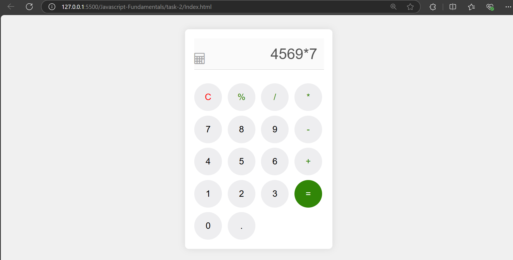

# Simple Calculator

## Created a simple calculator that user can perform certain operation like

- Addition
- Subtraction
- Multiplication
- Division
- Percentage

```bash
let outputDisplay = document.getElementById("outputDisplay");
```

- This access the dom element to get the access of input (collecting input and displaying result)

```bash
function appendToOutputDisplay(value){
    outputDisplay.value += value;
}
```

- Helps to collect all the input values in the format of appending (string)

```bash
function clearDisplay(){
    outputDisplay.value = "";
}
```

- Clears the result in the outputDisplay Screens

```bash

function calculate(){
    try {
        let result = eval(outputDisplay.value);
        outputDisplay.value = result;
    } catch (error) {
        outputDisplay.value = "Error";
    }
}
```

- This function allows to calculate the result using `eval` function
  - If the argument is an expression, eval() evaluates the expression.

## Output for Web View



## Output for Mobile View

