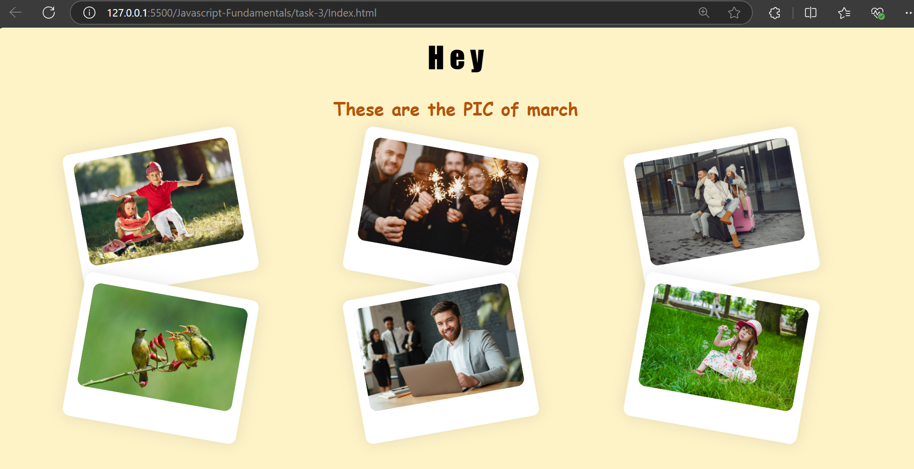
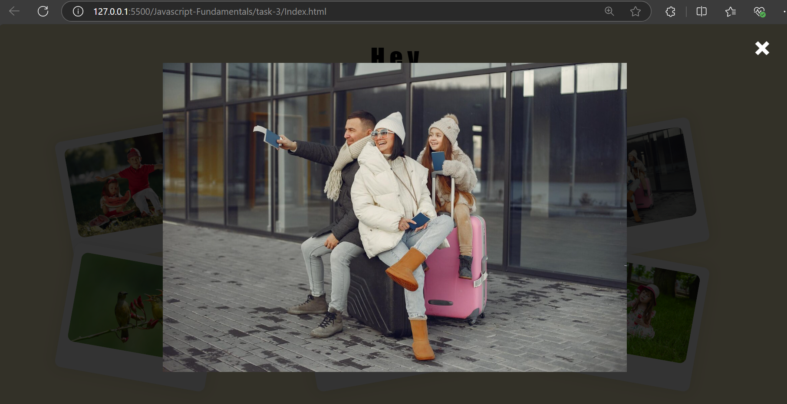
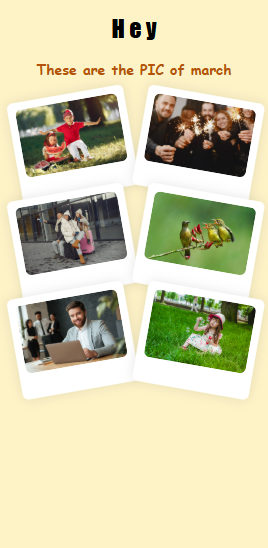

# Image Gallery Lightbox

## Created a webpage where the user can view the pic of the event happened in march

``` bash
const modal = document.getElementById("lightbox");
const modalImg = document.getElementById("modal-image");
const closeBtn = document.getElementsByClassName("close")[0];
const thumbnails = document.querySelectorAll(".gallery_collections img");
```
- This helps to get that object from html to access `DOM` Elements directly

``` bash 
thumbnails.forEach(thumbnail => {
    thumbnail.addEventListener("click", (e) => {
        const imagesrc = e.target.getAttribute("data-large");
        modalImg.src = imagesrc;
        modal.classList.add("show");
    });
});
```
- This makes the all the thumbails images to be clickable and set the image to the model

``` bash
closeBtn.addEventListener("click", () => {
    modal.classList.remove("show");
});
```
- This makes close of the model when close event occurs

``` bash
window.addEventListener("click", (e) => {
    if (e.target === modal) {
        modal.classList.remove("show");
    }
});
```
- If the user click outiside of the model , then that time also the model need to be closed


## Javascript Elements
| **Elements** | **Description** |
|--------------|-----------------|
| `getElementById`      | Defines a method to access HTML element by its unique ID|
| `getElementsByClassName`    | Defines a method that returns the  collection of elements under specified class name. |
| `querySelectorAll`      | Defines a method that selects the multiple DOM elements |
| `forEach`   | Helps to iterate the collection of elements. |
| `addEventListener`   | captures the events happened like click, keypress, etc,. |
| `e.target.getAttribute`  | Helps to get the value of the element that is targeted. |
| `classList.add & classList.remove`  | Used to add the class name of that elements dynamically


## Output for Web View




## Output for Mobile View


