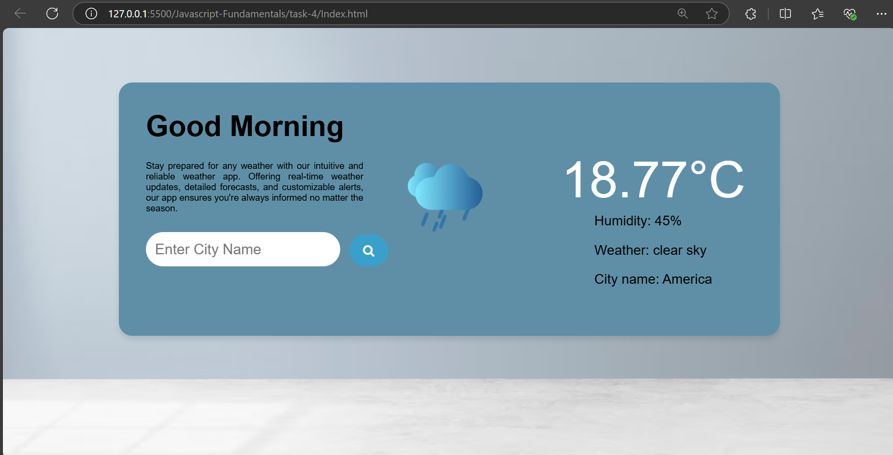
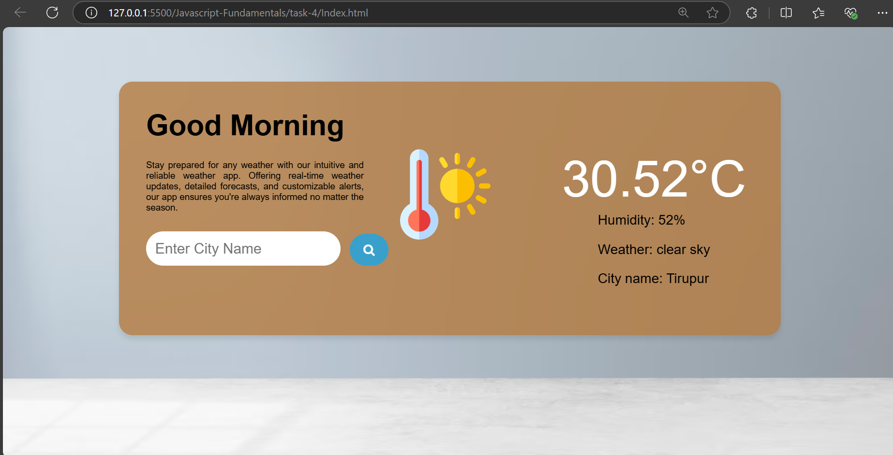
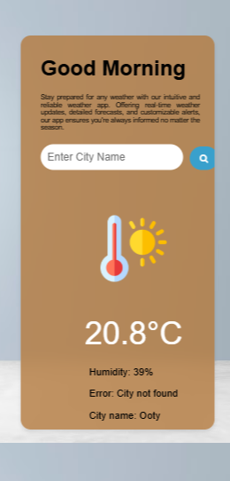

# Weather App with API Integration

## Created a realtime weather web application, which allows the user to find the weather based on input city value and the UI and color is changing according to the temperature.

``` bash
const city = document.getElementById('city');
const container = document.getElementsByClassName('container')[0];
const gif = document.getElementsByClassName('gif')[0];
const city_name = document.getElementById('city_name');
const temperature = document.getElementById('temperature');
const weather = document.getElementById('weather');
const humidity = document.getElementById('humidity');
```
- Used to get the html object access for updating content and styling


``` bash
async function getWeather(){
    const cityName = city.value; 
    const apiKey = ''; 
    const response = `https://api.openweathermap.org/data/2.5/weather?q=${cityName}&appid=${apiKey}&units=metric`; 

    try {
        let data = await fetch(response);
        
        if (!data.ok) {
            throw new Error('City not found');
        }
        
        let result = await data.json();
        city.value = '';
        
        if(result.main.temp > 20){
            gif.style.backgroundImage = 'url("./assests/heat.png")';
            gif.style.display = 'block';
            container.style.cssText = 'background-color:rgba(180, 123, 62, 0.8);box-shadow: 0 4px 6px rgba(0, 0, 0, 0.1);';
        } else if(result.main.temp > 10){
            if(result.main.humidity > 70){
                gif.style.backgroundImage = 'url("./assests/raining.gif")';
                gif.style.display = 'block';
                container.style.backgroundColor = '#3e88b4';
            } else {
                gif.style.backgroundImage = 'url("./assests/cloud.gif")';
                gif.style.display = 'block';
                container.style.backgroundColor = '#5f8fa6';
            }
        } else {
            gif.style.backgroundImage = 'url("./assests/cloudy.gif")';
                gif.style.display = 'block';
            container.style.backgroundColor = 'lightgrey';
        }
        
        city_name.innerHTML = `City name: `+ result.name;
        temperature.innerHTML = result.main.temp + '°C';
        weather.innerHTML = `Weather: `+result.weather[0].description;
        humidity.innerHTML = `Humidity: `+result.main.humidity + '%';
        

    } catch (error) {
        document.getElementById('weather').innerHTML = `Error: ${error.message}`;
    }
}
```
- This async function helps to retrieve the weather data using a openweather api and it will change the DOM elements styling accoriding to the temperature (hot sun or rainy cloud based on temperature and humidity)

## Javascript Elements
| **Elements** | **Description** |
|--------------|-----------------|
| `async and await function`      | Helps to pause execution until a promise resolves|
| `gif.style.backgroundImage`    | Defines to set a background image of the gif container. |
| `container.style.cssText `      | Allows the user to give a styling in css formatted text |
| `city_name.innerHTML `   | Helps to insert the data to the dom element directly. |


## Output for Web View




## Output for Moible view
