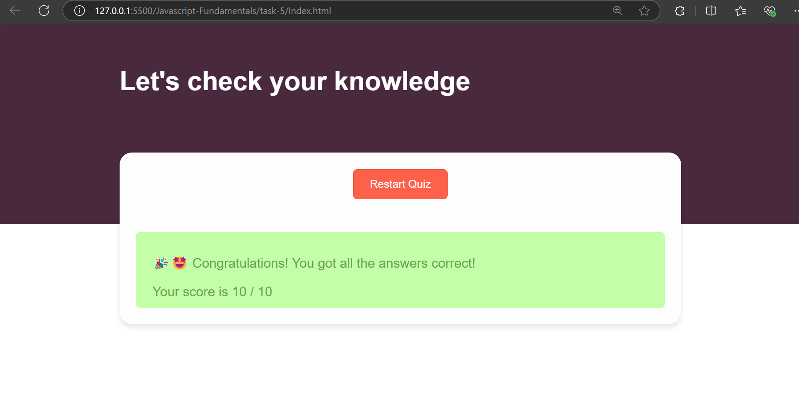

# Dynamic Quiz Application

## Created a quiz app, which allows the user 
- See the rules of the quiz before starting
- Disabled next until selection of current question option
- Once clicked, couldn't modified
- After completion show the score along with feedback of the test

``` bash
const question = document.getElementById("question");
const options = document.getElementById("options");
const next = document.getElementById("next");
const start = document.getElementById("start");
const restart = document.getElementById("restart");
const modal = document.getElementById("lightbox");
const description = document.getElementsByClassName("description")[0];
const start_description = description.querySelectorAll("p")[0];
const start_description_next = description.querySelectorAll("p")[1];
const closeBtn = document.getElementsByClassName("close")[0];
const resultDisplay = document.getElementById("resultDisplay");
const result_message = resultDisplay.querySelectorAll("p")[0];
const result = resultDisplay.querySelectorAll("div")[0];
```
- Connect DOM elements for accessing

``` bash
let currentQuestion = 0;
let score = 0;
let answerSelected = false;
const totalQuestions = 10;
```
- Initialize the variable for tracking the score, current questions, 

``` bash
fetch("./Questions.json")
  .then((response) => response.json())
  .then((data) => {
    Question_Array = data;
  });
```
- Get the questions from external json file

``` bash
function startQuiz() {
  start.style.display = "none";
  resultDisplay.style.display = "none";
  start_description.style.display = "none";
  start_description_next.style.display = "none";
  if (currentQuestion === 0) {
    modal.classList.add("show");
  }
  question.innerHTML =
    `${currentQuestion + 1}. ` + Question_Array[currentQuestion].question;
  options.innerHTML = "";
  result.innerHTML = "";
  result_message.innerHTML = "";
  next.innerHTML = `<button onclick="nextQuestion()" disabled>Next</button>`;
  const nextButton = next.querySelector("button");

  Question_Array[currentQuestion].answers.forEach((answer) => {
    const button = document.createElement("button");
    button.innerHTML = answer.answer;
    button.onclick = () => {
      checkAnswer(answer.correct);
      button.style.backgroundColor = answer.correct ? "#D1FAE5" : "#FEE2E2";

      const allButtons = options.querySelectorAll("button");
      allButtons.forEach((btn) => {
        const correctAnswer = Question_Array[currentQuestion].answers.find(
          (a) => a.answer === btn.innerHTML
        );

        if (correctAnswer.correct && btn !== button) {
          btn.style.backgroundColor = "#D1FAE5";
        }
        (btn.disabled = true), (answerSelected = true);
      });

      nextButton.disabled = false;
    };
    options.appendChild(button);
  });
}
```
- This function helps to start the quiz, by showing the current question (based on index) and options are shown, and also show the color indicate of correct and wrong options, finally it doesn't allow the mutli select option

``` bash
closeBtn.addEventListener("click", () => {
  modal.classList.remove("show");
});
```
- This event listener helps to close the rules modal initially

``` bash
function checkAnswer(correct) {
  if (correct) {
    score++;
  }
}
```
- Helps to increment the score of the quiz

``` bash

function nextQuestion() {
  if (currentQuestion < Question_Array.length - 1) {
    currentQuestion++;
    answerSelected = false;
    startQuiz();
  } else {
    question.innerHTML = "";
    options.innerHTML = "";
    next.innerHTML = "";

    if (score === totalQuestions) {
      result_message.innerHTML =
        "🎉🤩 Congratulations! You got all the answers correct!";
      resultDisplay.style.backgroundColor = "#c2ffa8";
      resultDisplay.style.color = "#67a54d";
    } else if (score > totalQuestions / 2) {
      result_message.innerHTML =
        "Good job! You got most of the answers correct!";
      resultDisplay.style.backgroundColor = "#c2ffa8";
      resultDisplay.style.color = "#67a54d";
    } else {
      result_message.innerHTML = "You need to study more!";
      resultDisplay.style.backgroundColor = "#fff1f2";
      resultDisplay.style.color = "#f68a77";
    }
    result.innerHTML = `Your score is ${score} / ${totalQuestions}`;
    restart.style.display = "block";
    resultDisplay.style.display = "block";
  }
}
```
- This function helps to move next question and also the end of the quiz based on the currentQuestion index 
    - It also provides the score and feedback (based on their scores)

``` bash
function restartQuiz() {
  currentQuestion = 0;
  score = 0;
  startQuiz();
  restart.style.display = "none";
  resultDisplay.style.display = "none";
  result.innerHTML = "";
  result_message.innerHTML = "";
}
```
- Helps to clear the tracking values, result values along with its styles


## Javascript Elements
| **Elements** | **Description** |
|--------------|-----------------|
| `fetch`      |Helps to load the external file or api data with a promise return|
| `const start_description = description.querySelectorAll("p")[0];`    | Find a paragraph tag under the division of description tag. |
| `btn.disabled = true`      | Allow to disable the option once the initial option is selected |
| `const nextButton = next.querySelector("button"); `   |Instead of selecting all the query tag, it can specifically return that query without collections. |

## Output for Web View

- Initally before starting quiz


- Rules of the quiz in modal view


- First question with a hovering effect


- If the selected answer if correct then the button is light green 


- In case wrong answer selection, show the wrong indication of selected option and also shows the correct option with color indication


- Incase if all the question are correct


- Incase the 1/2 th of the questions length and above or correct


- In case if the score is very low


## Output for Moible view
