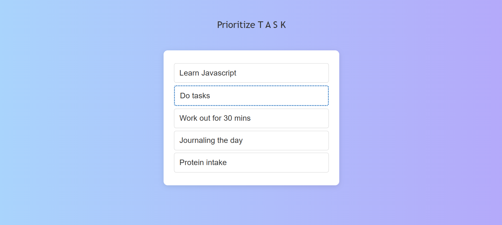
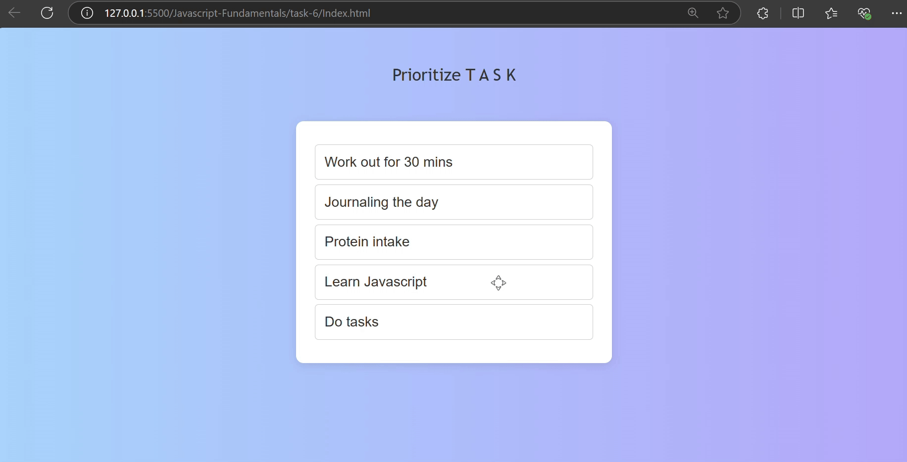

# Drag and Drop List Reordering

## Created a webpage which allows the user to drop the daily tasks based on priority

- get the access for dom manipulation and intialized the variable for tracking

```bash
const draggableList = document.getElementById("draggable-list");
let draggedItem = null;
```

- Initiates the dragging of the element with the help of event listener, this adds the dragging class name to the targeted event and stores the data currently dragged

```bash
draggableList.addEventListener("dragstart", (event) => {
  if (draggedItem) {
    draggedItem.classList.remove("dragging");
  }
  draggedItem = event.target;
  event.dataTransfer.effectAllowed = "move";
  event.dataTransfer.setData("text/html", draggedItem.innerHTML);
  event.target.classList.add("dragging");
});
```

- This dragenter event helps to provide a visual feedback to the user with a border bottom and top styling based on the offset values of mouse and target-item

```bash
draggableList.addEventListener("dragenter", (event) => {
  const targetItem = event.target.closest(".draggable-item");
  if (targetItem && targetItem !== draggedItem) {
    const allItems = draggableList.querySelectorAll(".draggable-item");
    allItems.forEach((item) => {
      item.style.borderTop = "";
      item.style.borderBottom = "";
    });

    const boundingRect = targetItem.getBoundingClientRect();
    const offset = boundingRect.y + boundingRect.height / 2;

    if (event.clientY > offset) {
      targetItem.style.borderBottom = "double 2px #333";
      targetItem.style.borderTop = "none";
    } else {
      targetItem.style.borderTop = "double 2px #333";
      targetItem.style.borderBottom = "none";
    }
  }
});
```

- This dragleave event helps to remove the styling applied in the drag enter event

```bash
draggableList.addEventListener("dragleave", (event) => {
  const targetItem = event.target.closest(".draggable-item");
  if (targetItem && targetItem !== draggedItem) {
    targetItem.style.borderTop = "none";
    targetItem.style.borderBottom = "none";
  }
});
```

- This dragover helps to add a drop effect of the target item

```bash

draggableList.addEventListener("dragover", (event) => {
  event.preventDefault();
  event.dataTransfer.dropEffect = "move";
});
```

- This drop event helps to drop the targeted list based on the mouse vertical point and offset of the targeted list

```bash
draggableList.addEventListener("drop", (event) => {
  event.preventDefault();
  const targetItem = event.target.closest(".draggable-item");

  if (targetItem && targetItem !== draggedItem) {
    if (
      event.clientY >
      targetItem.getBoundingClientRect().top + targetItem.offsetHeight / 2
    ) {
      targetItem.parentNode.insertBefore(draggedItem, targetItem.nextSibling);
    } else {
      targetItem.parentNode.insertBefore(draggedItem, targetItem);
    }
  }

  targetItem.style.borderTop = "";
  targetItem.style.borderBottom = "";
  draggedItem.style.opacity = "";
});

```

## Javascript Drag Events and elements

| **Events**                | **Description**                                                                                        |
| ------------------------- | ------------------------------------------------------------------------------------------------------ |
| `dragstart`               | Triggered when dragging starts, sets the dragged item and applies a "dragging" class.                  |
| `dragenter`               | Triggered when an item is dragged over a target, applies top or bottom border based on mouse position. |
| `dragleave`               | Triggered when the dragged item leaves the target, removes any applied borders.                        |
| `dragover`                | Triggered when an item is dragged over, enables the drop effect by preventing default behavior.        |
| `drop`                    | Triggered when the dragged item is dropped, moves the item to the new position and resets styles.      |
| `getBoundingClientRect()` | Returns the size of an element and its position relative to the viewport.                              |
| `offsetHeight`            | Provides the height of an element, including padding and borders, but excluding margins.               |
| `insertBefore`            | Inserts a node before another specified node as a child of the parent.                                 |
| `clientY`                 | Represents the vertical coordinate of the mouse pointer relative to the viewport during mouse events.  |

## Output for Web View





