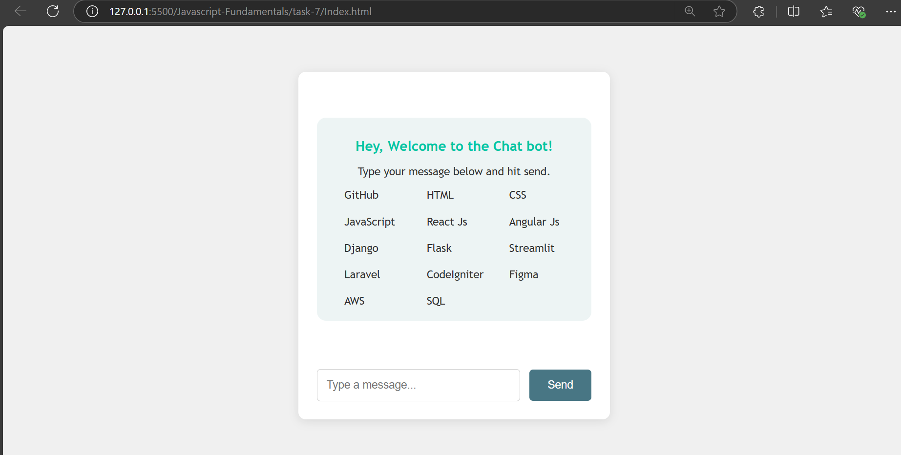
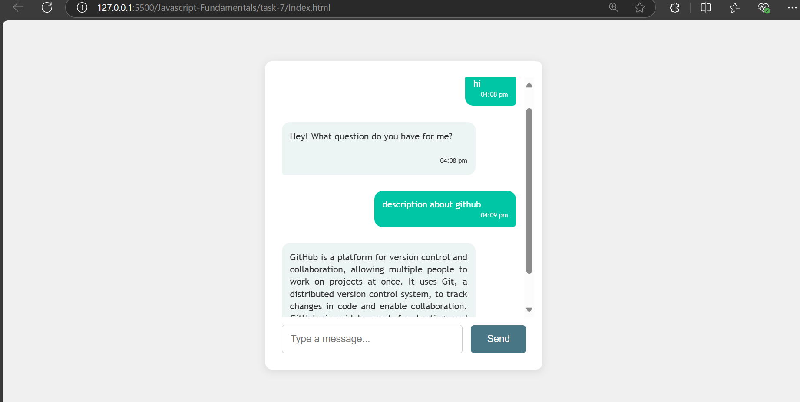
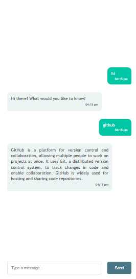

# Real-time Chat Simulation

## Created a webpage to answer the some of the technology and tools description

- Get DOM elements for manipulation

```bash
const chatBox = document.getElementById("chat-box");
const inputField = document.getElementById("message-input");
const greeting_message = document.getElementsByClassName("greeting")[0];
var loadingDots = document.getElementById("loading-dots");
```

- Get a time stamp for the chat message with a format of 2 digits

```bash
function createTimestamp() {
  const timestamps = new Date().toLocaleTimeString([], {
    hour: "2-digit",
    minute: "2-digit",
  });
  const timeElement = document.createElement("span");
  timeElement.classList.add("timestamp");
  timeElement.textContent = timestamps;
  return timeElement;
}
```

- To send a delayed message - delayed 1.5 seconds using `setTimeout`

```bash
function sendDelayedResponse(responseMessage) {
  loadingDots.style.display = "block";

  setTimeout(() => {
    const botMessageElement = document.createElement("div");
    botMessageElement.classList.add("message", "received");
    botMessageElement.textContent = responseMessage;
    const timeElement = createTimestamp();
    botMessageElement.appendChild(timeElement);

    chatBox.appendChild(botMessageElement);
    chatBox.scrollTop = chatBox.scrollHeight;
    loadingDots.style.display = "none";
  }, 1500);
}
```

- Triggers the message event function to get a initial message using a `random function` and also add a timestamp with that message

```bash
function sendMessage() {
  greeting_message.style.display = "none";
  let message = inputField.value.trim();
  if (message === "") return;
  message = message.toLowerCase();
  if (
    message.includes("hello") ||
    message.includes("hi") ||
    message.includes("hey") ||
    message.includes("greetings")
  ) {
    loadingDots.style.display = "block";
    const botGreetingIndex = Math.floor(Math.random() * botGreeting.length);
    const botGreetingMessage = botGreeting[botGreetingIndex];
    sendDelayedResponse(botGreetingMessage);
  } else {
    let foundMatch = false;
    for (let tech in technologyResponses) {
      if (message.toLowerCase().includes(tech.toLowerCase())) {
        sendDelayedResponse(technologyResponses[tech]);
        foundMatch = true;
        break;
      }
    }
    if (!foundMatch) {
      sendDelayedResponse("Sorry, please ask a relevant question.");
    }
  }

  const messageElement = document.createElement("div");
  messageElement.classList.add("message", "sent");
  messageElement.textContent = message;
  const timeElement = createTimestamp();
  messageElement.appendChild(timeElement);
  chatBox.appendChild(messageElement);

  inputField.value = "";
  chatBox.scrollTop = chatBox.scrollHeight;
}
```

## Javascript Elements

| **Elements**                                                                 | **Description**                                                                                       |
| ---------------------------------------------------------------------------- | ----------------------------------------------------------------------------------------------------- |
| `const technologyResponses`                                                  | This object helps to map with description for bot's message                                           |
| `const botGreeting`                                                          | this array message stores the greeting message for initial replay.                                    |
| `new Date().toLocaleTimeString`                                              | Get the time stamp in the format of readable format                                                   |
| `setTimeout`                                                                 | This method runs a function after a delayed time period - once.                                       |
| `chatBox.scrollTop = chatBox.scrollHeight;`                                  | Scroll to end of the container to see the latest message from bot.                                    |
| `  const botGreetingIndex = Math.floor(Math.random() * botGreeting.length);` | random function helps to get the bot initial message randomly based on the botGreeting array's length |
| ` inputField.value.trim()`                                                   | removes any leading and trailing whitespace from the value of the input field                         |


## Output for Web View





## Output for Mobile View
