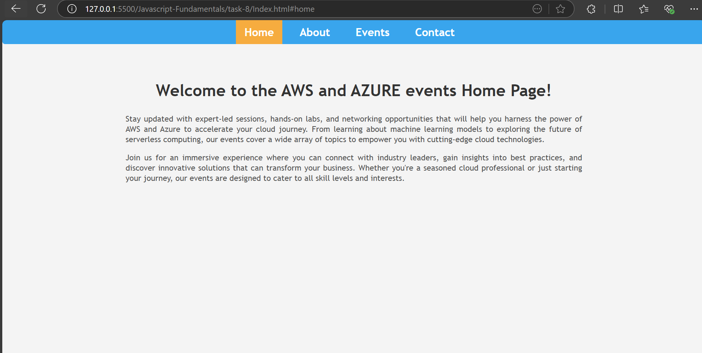
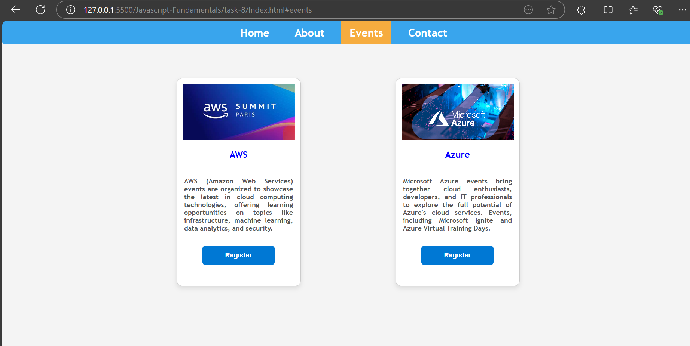

# Single-Page Application (SPA) with Hash-based Routing

## Steps

- To get the current hash events from location property and also set a default route when the page initially loads

``` bash
function navigateTo() {
    const hash = window.location.hash.replace('#', '') || 'home';
    updateView(hash);
    updateNav(hash);
}
```

- To show the dynamic content based on the route passed with a conditional route to catch the 404 message and displayed a message in h1 tag

``` bash
function updateView(route) {
    const views = document.querySelectorAll('.view');
    views.forEach(view => view.classList.remove('active'));
    const activeView = document.getElementById(route);

    if (activeView) {
        activeView.classList.add('active');
    } else {
        const errorView = document.createElement('h1');
        errorView.textContent = "404 - Page Not Found";
        document.body.innerHTML = '';
        document.body.appendChild(errorView); 
    }
}
```

- To update the active link to show the currently active url

``` bash
function updateNav(route) {
    const links = document.querySelectorAll('nav a');

    links.forEach(link => link.classList.remove('active'));
    const activeLink = document.querySelector(`a[href="#${route}"]`);
    if (activeLink) {
        activeLink.classList.add('active');
    }
}
```

- Whenever the url hash changes this navigateTO function executes

``` bash 
window.onhashchange = navigateTo;
```

- load the navigateTo function at the initial renders using `DOMContentLoaded` events

```  bash 
document.addEventListener('DOMContentLoaded', () => {
    navigateTo();
});
```

## Javascript Elements

| **Elements**                                                                 | **Description**                                                                                       |
| ---------------------------------------------------------------------------- | ----------------------------------------------------------------------------------------------------- |
| `window.location.hash`                                                  | This allows to get a portion of the url during navigation                                           |
| `document.querySelector(`a[href="#${route}"]`)`                                                          | This allows t dynamically select the current url route.                                    |
| `window.onhashchange = navigateTo;`                                              | Triggers whenever the url gets updated                                                  |
| `DOMContentLoaded`                                                                 | Call this events when the page loads initially.                                       |

## Output for Web View






