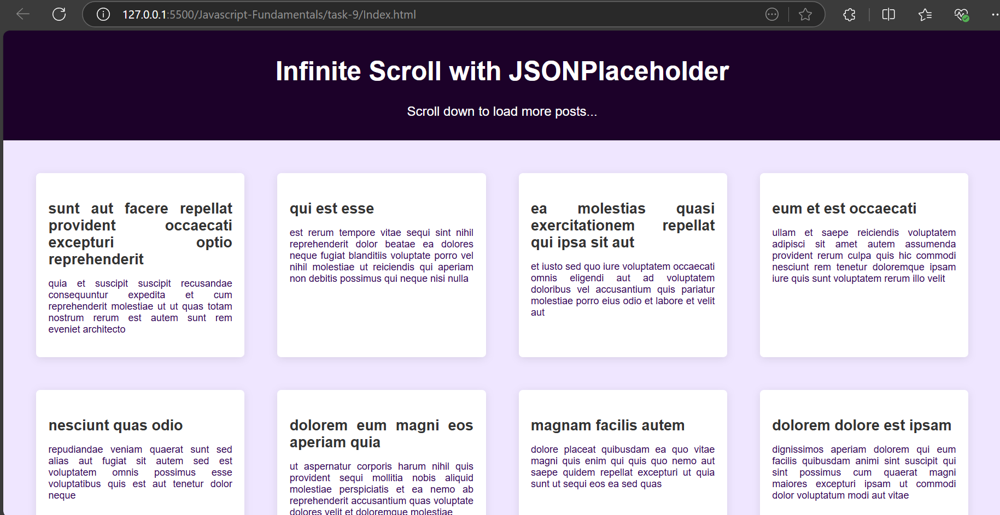
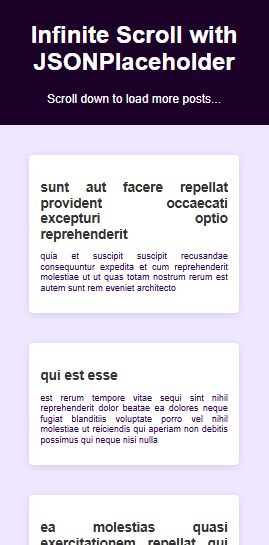

# Infinite Scrolling Content Loader

## Created a webpage that shows the random post header and description from JSON placeholder api

- Get element access for DOM manipulation

```bash
const postsContainer = document.getElementById('posts_container');
const loading = document.getElementById('loading');
```

- Track the currentPage for dynamically change the pages in API response

```bash
let currentPage = 1;
```

- use async function to fetch the posts response from JSONplaceholder api

```bash
async function fetchPosts(page) {
    try {
        const response = await fetch(`https://jsonplaceholder.typicode.com/posts?_limit=10&_page=${page}`);
        const posts = await response.json();
        return posts;
    } catch (error) {
        console.error("Error fetching posts:", error);
        return [];
    }
}
```

- Render post helps to insert that response data to the webpage by Direct DOM access

```bash
function renderPosts(posts) {
    posts.forEach(post => {
        const postElement = document.createElement('div');
        postElement.classList.add('post');
        postElement.innerHTML = `
            <h3>${post.title}</h3>
            <p>${post.body}</p>
        `;
        postsContainer.appendChild(postElement);
    });
}
```

- loadMorePosts function triggers when user scrolls to bottom of the webpage, in case if the api responses data is limited then reinitailized the current page variable

```bash

async function loadMorePosts() {
    loading.style.display = 'block';

    const posts = await fetchPosts(currentPage);

    if (posts.length > 0) {
        renderPosts(posts);
        currentPage++;
    } else {
        currentPage = 1;
        renderPosts(await fetchPosts(currentPage));
    }

    loading.style.display = 'none';
}

```

- Scroll event helps to find out the users scrolling activity, and with `innerHeight` and `scrollY` - vertical scrolling px is calculated and compared with overall document offsetHeight, then loadMorePosts function calculated based on that

```bash
window.addEventListener('scroll', () => {
    if (window.innerHeight + window.scrollY >= document.body.offsetHeight - 100) {
        loadMorePosts();
    }
});
```

## Javascript Elements

| **Elements**                                                              | **Description**                                                                    |
| ------------------------------------------------------------------------- | ---------------------------------------------------------------------------------- |
| `window.innerHeight`                                                      | Current visible screen size of the window                                          |
| `window.scrollY`                                                          | How much does the user scrolls towards the vertical axis.                          |
| `document.body.offsetHeight`                                              | Get the overall document's height                                                  |
| `window.innerHeight + window.scrollY >= document.body.offsetHeight - 100` | executes the condition before reaching bottom, this provides a smoother experience |

## Output for Web View




## Output for Mobile View

