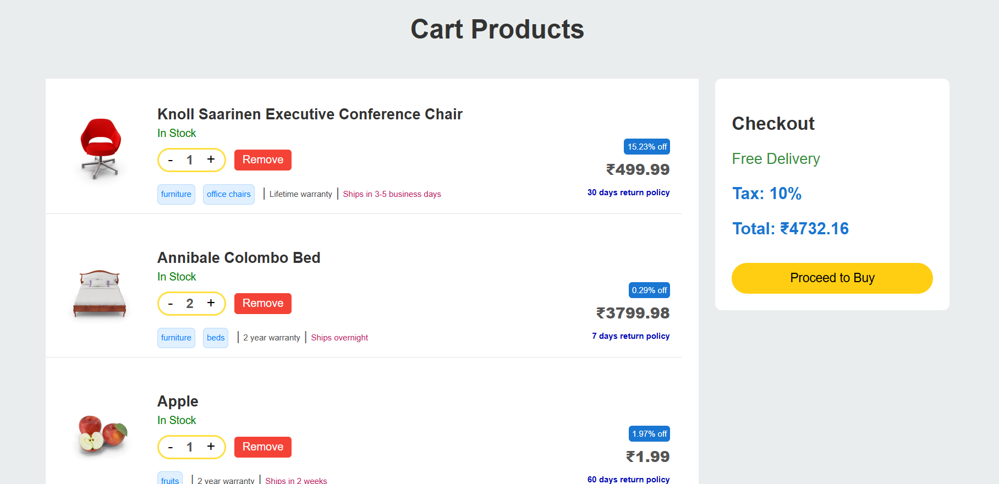
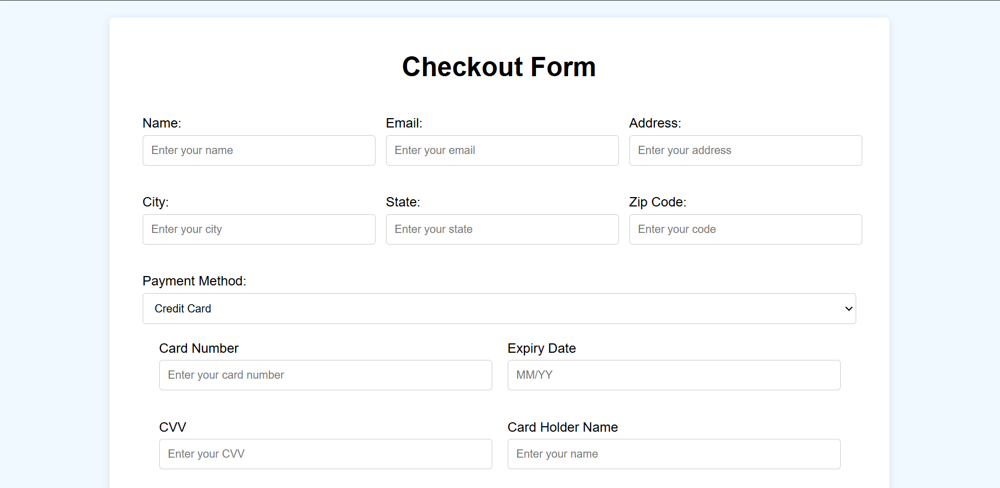
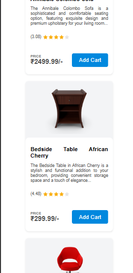
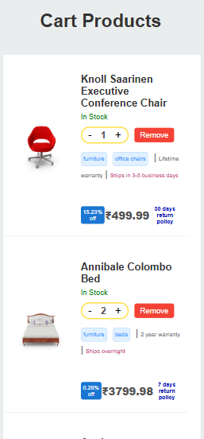

# Full-featured eCommerce Shopping Cart

## Created a e-commerce webpage with some functionality like

- Dynamic rendering of data from real time data from `dummy api`.
- `Filter` the products based on category.
- `Search options enabled` for title and description of the product.
- Cart added products are persisted throughout the page by using `localstorage`.
- Able to `view` products in cart and edit its quantity and even `remove` completely from the localstorage.
- Able to fill the details once made a `checkout` process and there is a dynamic input field for `payment option`, once completed a message will be showed up to the user.

---

### JS flow for Home page

- Get the access for DOM manipulation.

```js
const productListSection = document.getElementById("product-list");
const cart_count = document.getElementById("cart-count");
```

---

- Fetched the Products from a `dummy json api` which contains all the stuffs related to the products.

```js
async function fetchProducts() {
  const api_url = "https://dummyjson.com/products";
  const response = await fetch(api_url);
  const data = await response.json();
  const products = data.products;
  return products;
}
```

---

- `displayProducts` function is used to get the products and render to the dom element directly and also filters the category and searchQuery based on the input parameters.
- `productCard` - Inside this productcard the inner html added to display the details like `thumbnail`, `title`, `description`, `rating`, `price`, `add to cart button`.

```js
async function displayProducts(category = "", searchQuery = "") {
  const products = await fetchProducts();
  const productList = document.getElementById("product-list");
  const category_title = document.getElementById("category_title");
  productList.innerHTML = "";

  category_title.innerHTML = `Products in ${
    category ? category : "All"
  } Category`;

  const filteredProducts = products.filter((product) => {
    const matchesCategory = category
      ? product.category.toLowerCase() === category.toLowerCase()
      : true;
    const matchesSearch =
      product.title.toLowerCase().includes(searchQuery.toLowerCase()) ||
      product.description.toLowerCase().includes(searchQuery.toLowerCase());
    return matchesCategory && matchesSearch;
  });

  filteredProducts.forEach((product) => {
    const productCard = document.createElement("div");
    productCard.classList.add("product-card");

    let truncatedDescription = product.description;
    const periodIndex = truncatedDescription.indexOf(".");
    if (periodIndex !== -1) {
      truncatedDescription = truncatedDescription.slice(0, periodIndex) + "...";
    }

    productCard.innerHTML = `
        <div class="product-image-container">
          
        </div>
        <div class="product-info">
          <h3>${product.title}</h3>
          <p>${truncatedDescription}</p>
          <div class="rating-container">
            
            <p class="rating">(${product.rating})</p>
          </div>
          <div class="price-container">
            <p class="price"><span>PRICE</span> ₹${product.price.toFixed(
              2
            )}/-</p>
            <button class="add-to-cart">Add Cart</button>

          </div>
        </div>
      `;
    const addToCartButton = productCard.querySelector(".add-to-cart");
    addToCartButton.addEventListener("click", () => {
      AddCart(product);
    });

    productList.appendChild(productCard);
  });
}
```

---

- To filter the product list based on the category of the products and add a `active` class for the `currently` clicked items.
- pass that category to `displayProducts` function for filtration and after the category sort, implemented a smooth scrolling to the products list.

```js
const categoryItems = document.querySelectorAll("nav ul li");
categoryItems.forEach((item) => {
  item.addEventListener("click", () => {
    const category = item.getAttribute("data-category");
    categoryItems.forEach((el) => el.classList.remove("active"));
    item.classList.add("active");
    displayProducts(
      category.toLowerCase(),
      document.getElementById("search-box").value
    );

    productListSection.scrollIntoView({
      behavior: "smooth",
      block: "start",
    });
  });
});
```

---

- Get the search input and pass to displayProducts function for filtration based on `title` and `description`.

```js
const searchInput = document.getElementById("search-box");
searchInput.addEventListener("input", () => {
  const searchQuery = searchInput.value;
  displayProducts(
    document.querySelector("nav ul li.active")?.getAttribute("data-category"),
    searchQuery
  );
});
```

---

- Added the products to the localstorage for keeping the persistence across the pages.

```js
const AddCart = (Product) => {
  const cart = JSON.parse(localStorage.getItem("cart")) || [];
  const existingProductIndex = cart.findIndex((item) => item.id === Product.id);
  if (existingProductIndex !== -1) {
    cart[existingProductIndex].quantity += 1;
  } else {
    Product.quantity = 1;
    cart.push(Product);
  }
  localStorage.setItem("cart", JSON.stringify(cart));
  alert("Product added to cart!");
  console.log(Product);
  location.reload();
};
```

---

- Keep on take a `unique` product count from the `localstorage` and updated to frontend.

```js
function updateCartCount() {
  const cart = JSON.parse(localStorage.getItem("cart")) || [];
  const uniqueCartCount = new Set(cart.map((item) => item.id)).size;
  if (cart_count) {
    cart_count.innerHTML = uniqueCartCount;
  }
}
```

---

### JS flow for cart page

- Get the html elements for access the content and also get the localstorage content for cartItems

```js
const cartProducts = document.getElementById("cart-products");

const cartItems = JSON.parse(localStorage.getItem("cart")) || [];
const cartCount = document.getElementById("cart-count");
const cartTotal = document.getElementById("cart-total");
```

---

- Displayed the products stored in `localstorage` to the `cart html` webpage.
- All the necessary information are inserted to that dom elements like `thumbnail`, `title`, `availabilityStatus`,`quantity`, `discountPercentage`, `returnPolicy`, `price`, `warranty-info`, `shipping-info`.
- Also implemented the quantity increment and decrement feature for each product.

```js
const displayCartProducts = () => {
  cartProducts.innerHTML = "";

  if (cartItems.length === 0) {
    cartProducts.innerHTML = `<p class="empty-msg">Your cart is empty.</p>`;
    return;
  }

  let total = 0;

  cartItems.forEach((item) => {
    const productElement = document.createElement("div");
    productElement.classList.add("cart-product");

    productElement.innerHTML = `
        
        <div class="product-info">
            <h3>${item.title}</h3>
            <p id="stock">${item.availabilityStatus}</p>
            <div class="quantity-container">
            <div class="border-box">
                <button class="quantity-btn-decrease">-</button>
                <p class="quantity-display">${item.quantity}</p>
                <button class="quantity-btn-increase">+</button>
                </div>
                 <button class="remove-btn" data-id="${item.id}">Remove</button>
            </div>
            <div class="tags-container">
           <p>
          ${item.tags
            .map((i) => `<span class="tag">${i}</span>`)
            .join(" ")} | <span class="warrant-info">${
      item.warrantyInformation
    }</span> | <span class="shipping-info">${item.shippingInformation}</span>
        </p>
        </div>
            <div class="price-container">
            <button class="discount">${item.discountPercentage}% off</button>
            <p class="price">₹${(item.price * item.quantity).toFixed(2)}</p>
            <p class="return-policy">${item.returnPolicy}</p>
      
            </div>
    
        </div>
        `;

    const stock = productElement.querySelector("#stock");
    if (item.availabilityStatus == "Low Stock") {
      stock.style.color = "red";
    } else {
      stock.style.color = "green";
    }
    const increaseButton = productElement.querySelector(
      ".quantity-btn-increase"
    );
    const decreaseButton = productElement.querySelector(
      ".quantity-btn-decrease"
    );
    const removeButton = productElement.querySelector(".remove-btn");

    increaseButton.addEventListener("click", () => {
      item.quantity++;
      localStorage.setItem("cart", JSON.stringify(cartItems));
      displayCartProducts();
    });

    decreaseButton.addEventListener("click", () => {
      if (item.quantity > 1) {
        item.quantity--;
        localStorage.setItem("cart", JSON.stringify(cartItems));
        displayCartProducts();
      } else {
        const confirmRemove = confirm(
          "Do you want to remove this item from the cart?"
        );
        if (confirmRemove) {
          removeFromCart(item.id);
        }
      }
    });

    removeButton.addEventListener("click", () => {
      removeFromCart(item.id);
    });
    cartProducts.appendChild(productElement);

    total += item.price * item.quantity;
  });

  cartTotal.innerHTML = `
    <p>Tax: 10% </p>
    <p>Total: ₹${(total + total * 0.1).toFixed(2)}</p>
  `;
};
```

---

- Cart added product are able to remove from the cart, and during that process the localstorage products also removed based on its `productId`.

```js
const removeFromCart = (productId) => {
  console.log(productId);
  const cart = JSON.parse(localStorage.getItem("cart")) || [];
  const updatedCart = cart.filter((item) => item.id !== productId);
  localStorage.setItem("cart", JSON.stringify(updatedCart));
  location.reload();
  displayCartProducts();
};
```

---

### JS flow for from page

- Get the html object elements for manipulating.

```js
const paymentMethod = document.querySelector("#payment-method");
const formSection = document.querySelector("#checkout-form");
const paymentContainer = document.querySelector(".payment-details");
const formWholeContainer = document.getElementsByClassName("form-container")[0];
const qrContainer = document.querySelector("#upi-qr-container");
const formSubmitButton = document.querySelector("#form-submit-button");
const totalAmount = document.getElementsByClassName("total-amount")[0];
```

---

- `QRious` is a javascript library, which helps to generate the qrCode based on the input url.

```js
const qr = new QRious({
  size: 200,
});
```

---

- Calculate the `total amount` for the products stored in the `localstorage` and add to textContent of `totalAmount` container.

```js
function totalAmountCal() {
  const cartItems = JSON.parse(localStorage.getItem("cart"));
  let total = 0;
  cartItems.forEach((item) => {
    total += item.price * item.quantity;
  });
  let tax = total * 0.1;
  total += tax;
  total = total.toFixed(2);
  totalAmount.textContent = `Total Amount: ₹${total}`;
}
```

---

- `formSubmitButton` - Listen a click for displaying submitted message.
- `formSection.checkValidity()` - Helps to track that all the required field are filled with necessary values.
- `form.reportValidity()` - triggers the validation to show up.

```js
formSubmitButton.addEventListener("click", (event) => {
  if (formSection.checkValidity()) {
    event.preventDefault();
    formWholeContainer.classList.add("form-submitted");
    formWholeContainer.innerHTML = `
    <div>
        <h2>Form Submitted Successfully!</h2>
        <p>Thank you for Ordering.</p>
        <p>We'll notify once order has been shipped</p>
    </div>
  `;
  } else {
    form.reportValidity();
  }
});
```

---

- Add a event listener for a drop down payment option and dynamically change based on `Credit-card`, `UPI`, `net-banking`, `cash on delivery`.

```js
paymentMethod.addEventListener("change", (event) => {
  const selectedPaymentMethod = event.target.value;
  if (selectedPaymentMethod == "credit-card") {
    paymentContainer.innerHTML = `
        <div>
        <label for = "card-number">Card Number</label>
        <input type="text" id="card-number" placeholder="Enter your card number" required>
        </div>
        
        <div>
        <label for = "expiry-date">Expiry Date</label>
        <input type="text" id="expiry-date" placeholder="MM/YY" required>
        </div>

        <div>
        <label for = "cvv">CVV</label>
        <input type="text" id="cvv" placeholder="Enter your CVV" required>
        </div>

        <div>
        <label for = "card-holder-name">Card Holder Name</label>
        <input type="text" id="card-holder-name" placeholder="Enter your name" required>
        </div>

        <div>
        <label for = "billing-address">Billing Address</label>
        <input type="text" id="billing-address" placeholder="Enter your billing address" required>
        </div>
        
    `;
  } else if (selectedPaymentMethod == "upi") {
    paymentContainer.innerHTML = ``;
    qrContainer.innerHTML = ``;
    const upiString = "upi://pay?pa=demo@upi&pn=demo%20Name&am=1&cu=INR";
    qr.value = upiString;
    qrContainer.appendChild(qr.canvas);
    const label = document.createElement("p");
    label.textContent = "Scan this QR to pay via UPI";
    qrContainer.appendChild(label);
  } else if (selectedPaymentMethod == "net-banking") {
    qrContainer.innerHTML = ``;
    paymentContainer.innerHTML = `
        <div>
        <label for = "bank-name">Bank Name</label>
        <input type="text" id="bank-name" placeholder="Enter your bank name" required>
        </div>

        <div>
        <label for = "account-number">Account Number</label>
        <input type="text" id="account-number" placeholder="Enter your account number" required>
        </div>

        <div>
        <label for = "ifsc-code">IFSC Code</label>
        <input type="text" id="ifsc-code" placeholder="Enter your IFSC code" required>
        </div>

        <div>
        <label for = "account-holder-name">Account Holder Name</label>
        <input type="text" id="account-holder-name" placeholder="Enter your name" required>
        </div>

    `;
  } else {
    paymentContainer.innerHTML = `
    `;
    qrContainer.innerHTML = ``;
  }
});
```

---

## Output for Web view







## Output for Mobile view







## Localstorage


## Demo


